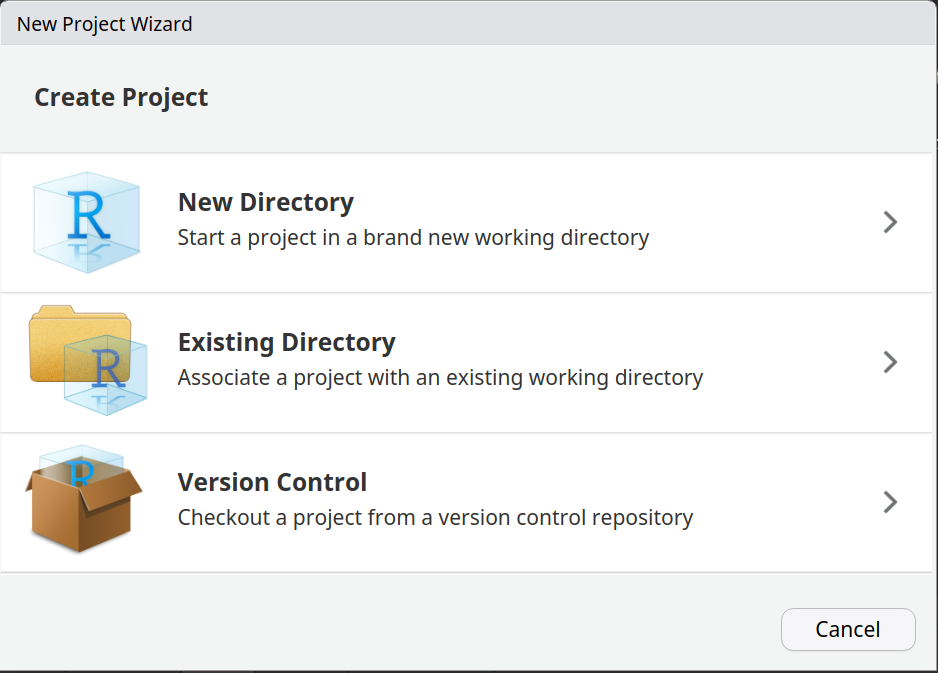
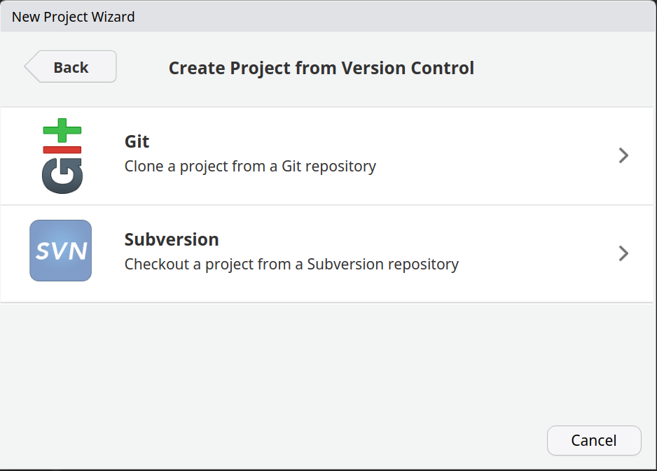
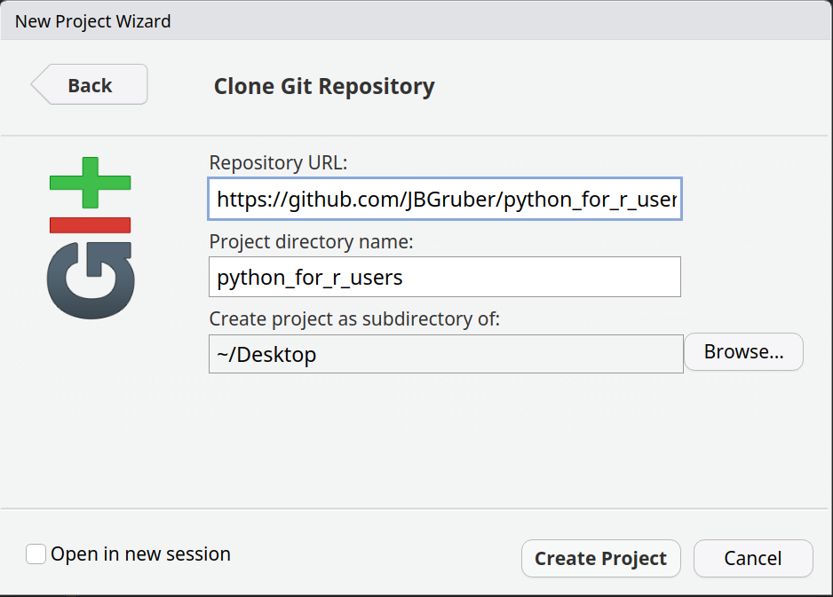

README
================

# WORKSHOPS FOR UKRAINE: Python for R users

Material for the workshop *Python for R users* on Thursday, February
16th, 18:00 - 20:00 CET (Rome, Berlin, Paris timezone). More info on the
course and how to sign up/get the recording at
https://sites.google.com/view/dariia-mykhailyshyna/main/r-workshops-for-ukraine#h.36dsv5tl42am

# Download the project

In RStudio go to “Create a project” (top left corner with this symbol
). Then select “Version Control”:



In the next window, select “Git”:



Then copy the URL `https://github.com/JBGruber/python_for_r_users` into
the URL field and select where to download the project to.



After clicking “Create Project”, a new session should open. Navigate to
the file “python-in-r.qmd” and open it. That’s it!

# Install dependencies

The short code below will check the main python-in-r.qmd file for
mentioned R packages and install the missing ones on your computer:

``` r
if (!requireNamespace("rlang", quietly = TRUE)) install.packages("rlang", dependencies = TRUE)
if (!rlang::is_installed("quanteda.corpora")) remotes::install_github("quanteda/quanteda.corpora")
rlang::check_installed("attachment")
rlang::check_installed(attachment::att_from_rmds("python-in-r.qmd"))
```

If there is no output, you are good to go.

We will install the Python packages during the workshop, but if you want
to get a head start, you can follow the “Getting started” section in the
“python-in-r.qmd” file.
